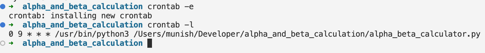
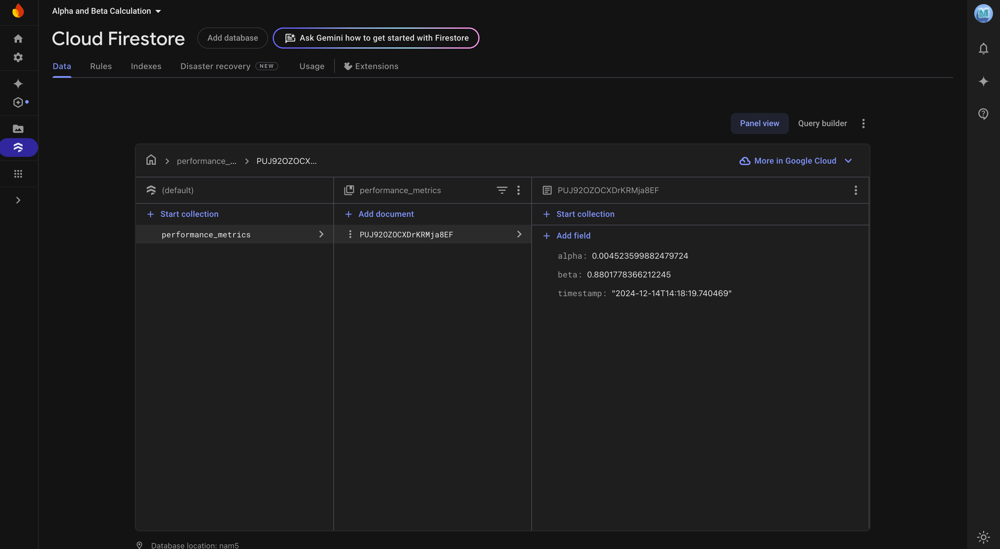
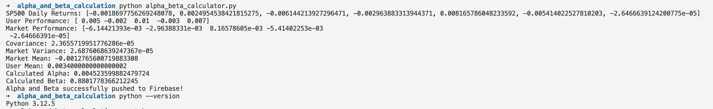

# Alpha and Beta Weekly Calculator

*Screenshot 1: Cron Job Setup*


*Screenshot 2: Firebase Firestore Results*


*Screenshot 3: Script Output*


---

## Features

- **Alpha and Beta Calculation**:
  - Computes the alpha (excess return) and beta (volatility) for the user compared to SP500 over the last 5 trading days.
- **Real Market Data**:
  - Fetches real SP500 data using the Yahoo Finance API (`yfinance`).
- **Firebase Integration**:
  - Pushes calculated results (alpha and beta) to a Firebase Firestore database.
- **Automation**:
  - Script runs weekly using a cron job.

---

## Requirements

- Python 3.7+
- Libraries:
  - `yfinance`
  - `numpy`
  - `firebase-admin`
- Firebase Service Account Credentials (JSON file)
- Cron job for weekly automation

---

## Installation

### 1. Clone the Repository
```bash
git clone https://github.com/MunishMummadi/alpha_beta_calculator.git
cd alpha_beta_calculator